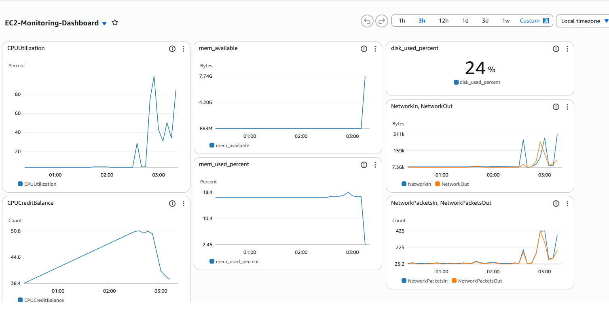
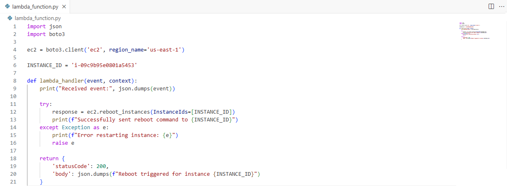

## 📊 AWS Cloud Monitoring & Auto-Healing Dashboard

This project demonstrates an automated monitoring and alerting system using AWS CloudWatch, SNS, and Lambda.

It tracks EC2 instance metrics (CPU, memory, disk, and network), triggers alarms when thresholds are exceeded, sends notifications via SNS, and automatically restarts the instance using a Lambda function.

---

### 🚀 Architecture Overview
- **CloudWatch Metrics:** Collect EC2 performance data  
- **CloudWatch Alarms:** Trigger when CPU > 80%  
- **SNS Topic:** Sends email/SMS alerts and invokes Lambda  
- **Lambda Function:** Reboots the instance automatically  

---

### 🖼️ Project Screenshots

**CloudWatch Dashboard**

**Lambda Function**

**SNS Invoked by CloudWatch Alarm**

**Lambda Function Invoked by SNS**

---

### 🧩 Technologies Used
- AWS CloudWatch  
- Amazon SNS  
- AWS Lambda (Python)  
- Amazon EC2  
- AWS CLI  

---

### ✅ Results
When CPU utilization exceeds the threshold:
1. CloudWatch Alarm fires  
2. SNS sends an email alert  
3. Lambda function is invoked via SNS  
4. EC2 instance automatically reboots  

This demonstrates real-world **cloud automation, monitoring, and incident response**.

**Author**: Alex King
